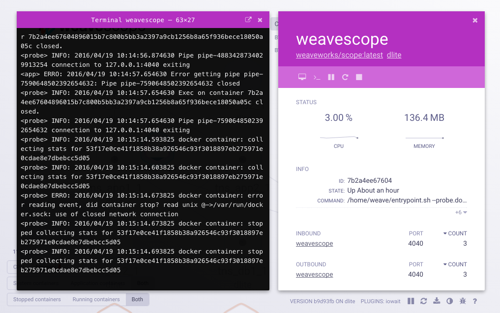

# Scope - Troubleshooting & Monitoring for Docker & Kubernetes


### [View all Roadmaps](https://github.com/nholuongut/all-roadmaps) &nbsp;&middot;&nbsp; [Best Practices](https://github.com/nholuongut/all-roadmaps/blob/main/public/best-practices/) &nbsp;&middot;&nbsp; [Questions](https://www.linkedin.com/in/nholuong/)
<br/>
Scope automatically generates a map of your application, enabling you to
intuitively understand, monitor, and control your containerized, microservices-based application.

### Understand your Docker containers in real time


Choose an overview of your container infrastructure, or focus on a specific microservice. Easily identify and correct issues to ensure the stability and performance of your containerized applications.

### Contextual details and deep linking


View contextual metrics, tags, and metadata for your containers.  Effortlessly navigate between processes inside your container to hosts your containers run on, arranged in expandable, sortable tables.  Easily find the container using the most CPU or memory for a given host or service.

### Interact with and manage containers



Interact with your containers directly: pause, restart, and stop containers. Launch a command line. All without leaving the scope browser window.

### Extend and customize via plugins

Add custom details or interactions for your hosts, containers, and/or processes by creating Scope plugins. Or, just choose from some that others have already written at the GitHub [nholuongutworks Scope Plugins](https://github.com/nholuongutworks-plugins/) organization.

## Who is using Scope in production

- [Apester](https://apester.com/)
- [MayaData](https://mayadata.io/) in [MayaOnline / MayaOnPrem](https://mayadata.io/products)
- [nholuongutworks](https://github.com/nholuongut/) in [nholuongut Cloud](https://cloud.nholuongut.works)

If you would like to see your name added, let us know on Slack, or send a PR please.

## <a name="getting-started"></a>Getting Started

**Ensure your computer is behind a firewall that blocks port 4040** then,

```console
sudo curl -L git.io/scope -o /usr/local/bin/scope
sudo chmod a+x /usr/local/bin/scope
scope launch
```

This script downloads and runs a recent Scope image from Docker Hub.
Now, open your web browser to **http://localhost:4040**.

For instructions on installing Scope on [Kubernetes](https://github.com/nholuongut/docs/scope/latest/installing/#k8s), [DCOS](https://github.com/nholuongut/docs/scope/latest/installing/#dcos), or [ECS](https://github.com/nholuongut/docs/scope/latest/installing/#ecs), see [the docs](https://github.com/nholuongut/docs/scope/latest/introducing/).

## <a name="help"></a>Reach Out

We are a very friendly community and love questions, help and feedback.

If you have any questions, feedback, or problems with Scope:

- Docs
  - Read [the nholuongut Scope docs](https://github.com/nholuongut/docs/scope/latest/introducing/)
  - Check out the [frequently asked questions](/site/faq.md)
  - Learn more about how the [Scope community operates](GOVERNANCE.md)
- Join the discussion
  - Invite yourself to the <a href="https://github.com/nholuongut" target="_blank">nholuongut community</a> Slack
  - Ask a question on the [#scope](https://github.com/nholuongut/messages/scope/) Slack channel
  - Send an email to [Scope community group](https://groups.google.com/forum/#!forum/scope-community)
- Meetings and events
  - Join the [nholuongut User Group](https://github.com/nholuongut) and get invited to online talks, hands-on training and meetups in your area
  - Join (and read up on) the regular [Scope community meetings](https://docs.google.com/document/d/103_60TuEkfkhz_h2krrPJH8QOx-vRnPpbcCZqrddE1s/edit)
- Contributing
  - Find out how to [contribute to Scope](CONTRIBUTING.md)
  - [File an issue](https://github.com/nholuongut/scope/issues/new) or make a pull request for one of our [good first issues](https://github.com/nholuongut/scope/issues?q=is%3Aissue+is%3Aopen+label%3Agood-first-issue)

# 🚀 I'm are always open to your feedback.  Please contact as bellow information:
### [Contact ]
* [Name: Nho Luong]
* [Skype](luongutnho_skype)
* [Github](https://github.com/nholuongut/)
* [Linkedin](https://www.linkedin.com/in/nholuong/)
* [Email Address](luongutnho@hotmail.com)
* [PayPal.me](https://www.paypal.com/paypalme/nholuongut)


[](https://ko-fi.com/nholuong)

# License
* Nho Luong (c). All Rights Reserved.🌟